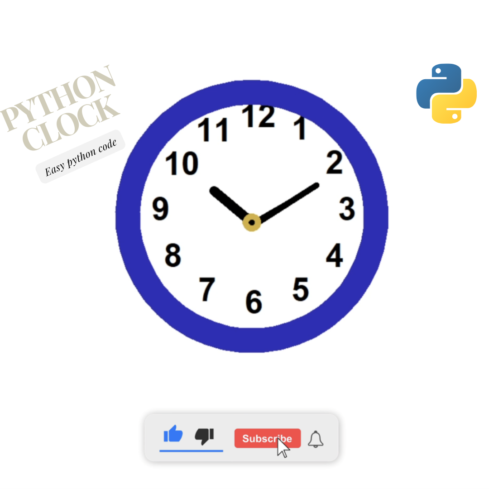

# Python Wall Clock
In this tutorial ([Open in Youtube](https://youtu.be/sGLVtz43Djk)), I'm going to show you how to make beautiful wall clock using the python code.

# Screenshot
Here we have project screenshot :

# snakecoding_12

We create a project each 4 days with voting on our <a href="https://youtube.com/@snakecoding_12" target="_blank">Youtube</a> channel.
You can vote for upcoming projects on our channel **community** page :wink:
